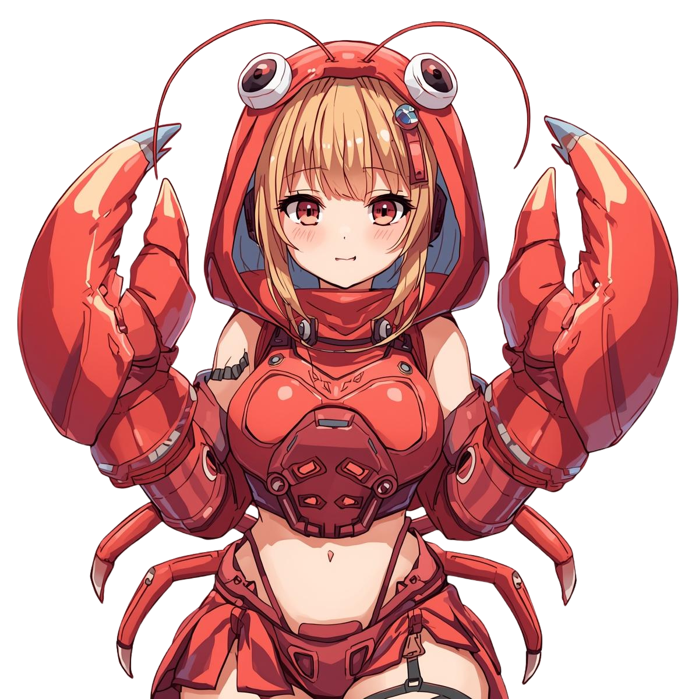
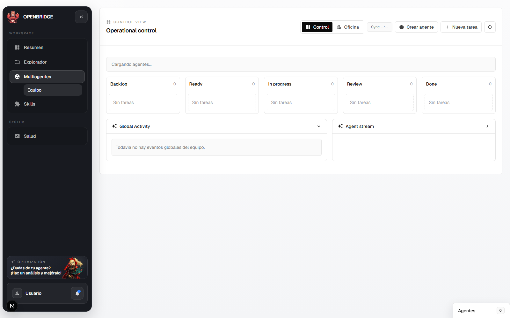

<p align="center">
  
</p>

<h1 align="center">OPENBRIDGE</h1>

<p align="center">
  A visual control layer for OpenClaw.
</p>

<p align="center">
  Connect a VPS, install or detect OpenClaw, create agents, switch models, assign real work, and operate everything from one polished interface.
</p>

<p align="center">
  <strong>Built for people who want agent operations to feel like a product, not a terminal session.</strong>
</p>

## Product preview

<table>
  <tr>
    <td width="50%">
      
    </td>
  </tr>
</table>

## What OPENBRIDGE feels like

OPENBRIDGE is designed to make remote agent operations simpler, faster, and easier to understand.

Instead of stitching together shell commands, scattered configs, and manual setup steps, you get a visual control console for:

- connecting to a VPS
- installing OpenClaw from scratch
- linking an existing OpenClaw installation
- creating agents from preloaded templates
- switching models in one click
- assigning tasks and tracking work visually
- operating multi-agent workflows from a control view
- browsing the installation itself from a visual explorer

## Why it stands out

### One-click onboarding
New users can connect a server, choose an install path, configure a provider, and leave the environment ready to use without editing environment files by hand.

### Agent creation that feels fast
OPENBRIDGE includes preloaded agent templates, real model selection, and a cleaner creation flow so new agents are useful from the start.

### Model control without friction
Switch models directly from the UI for both new and existing agents using the same OpenRouter-powered flow.

### Multi-agent operations, visually
Tasks, assignments, activity, logs, and direct chats are all organized around an interface built for day-to-day operations.

### Explorer for the actual installation
The explorer is aimed at the OpenClaw installation itself, not just a workspace folder, so it is easier to understand what is running and where things live.

## Core highlights

### Guided setup
- connect a VPS from the product
- choose existing install or clean install
- configure provider and default model
- define the first agent during setup

### Agent management
- create agents from functional templates
- rename and organize agents
- change models in one click
- chat directly with agents
- keep logs and operational context in one place

### Task operations
- create and assign tasks visually
- run assigned work from the dashboard
- review task details and updates in modal flows

### Visual control
- control-first multi-agent view
- alternative office view
- right-side chat system for multiple agent conversations

### Installation management
- edit VPS settings later
- change installation paths
- update provider details
- manage the base OpenClaw environment from a proper settings screen

## Quick start

```bash
npm install
npm run dev
```

Then open:

```text
http://localhost:3000
```

That is enough to start locally.

## First-run experience

When you open OPENBRIDGE for the first time, the product helps you:

1. connect to a VPS
2. choose between using an existing installation or installing from zero
3. configure the provider and model
4. create the first agent
5. start operating the environment visually

## Supported providers

OPENBRIDGE currently supports setup flows for:

- OpenRouter
- OpenAI
- Anthropic
- Google Gemini
- xAI
- Ollama

## Best fit for

- solo builders running OpenClaw on a remote server
- teams that want a more visual operating layer for agents
- people who want simpler onboarding for OpenClaw
- users who need fast model switching and cleaner control over multiple agents

## Product direction

OPENBRIDGE is being shaped as an open-source product focused on:

- easier OpenClaw adoption
- better agent operations UX
- cleaner remote setup and configuration
- more visual multi-agent control
- a friendlier bridge between agent power and real product usability

## Open source

OPENBRIDGE is being prepared for public open-source use.

The goal is simple:

> make OpenClaw environments easier to start, easier to understand, and easier to operate every day.
